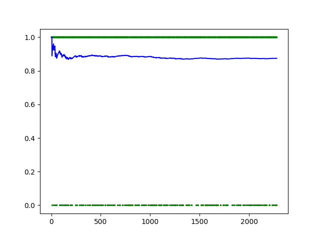

## Experiments

> Record 1

```
num_samples = 16000
target_sample_rate = 16000
learning_rate = 0.005
drop = 0.5

mel_spectrogram = torchaudio.transforms.MelSpectrogram(
    sample_rate=target_sample_rate,
    n_fft=400,
    hop_length=512,
    n_mels=84
)

sequence_length = 84
input_size = 32
output_size = 2
hidden_size = 2
num_layers = 5

optimizer = optim.Adam(model_0.parameters(),lr = learning_rate)
loss_fn = nn.BCELoss()
```

Below shows a graph plotting the losses over 2280 times of trainning for 10 epochs.


> Record 2

```
Params are not modified.
Model trained upon last record.
```

Below shows a graph plotting the losses over 2280 times of trainning for additional 10 epochs.

